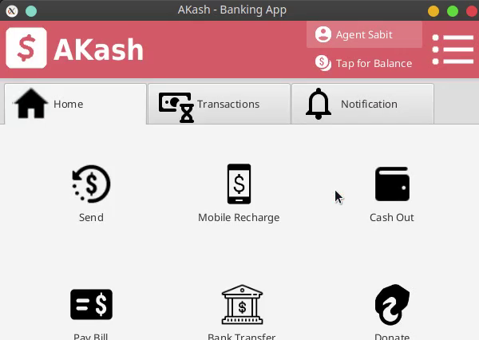
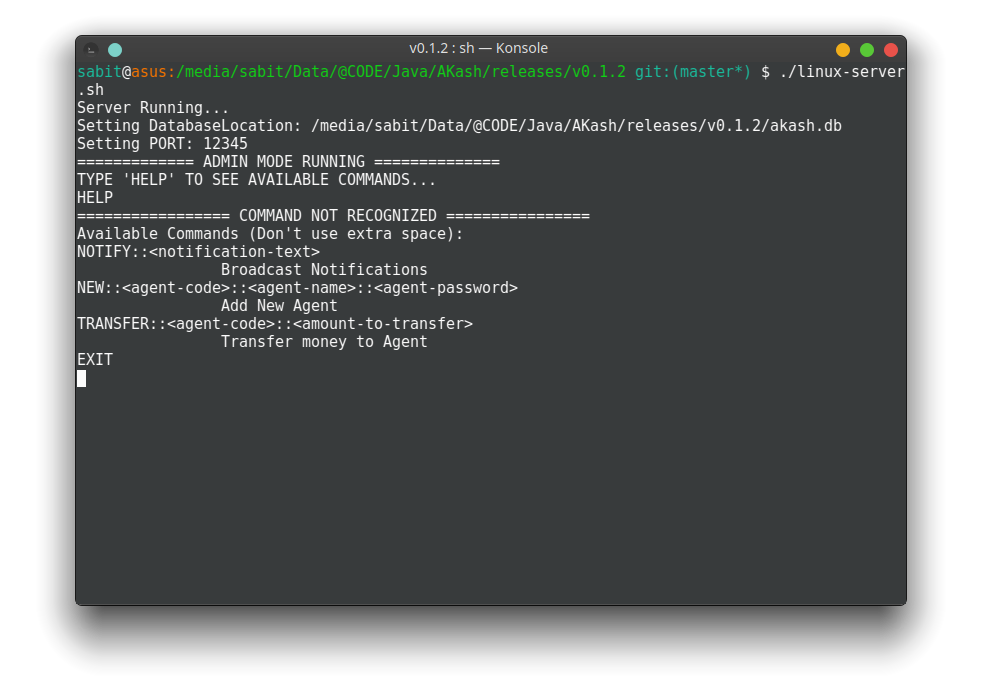
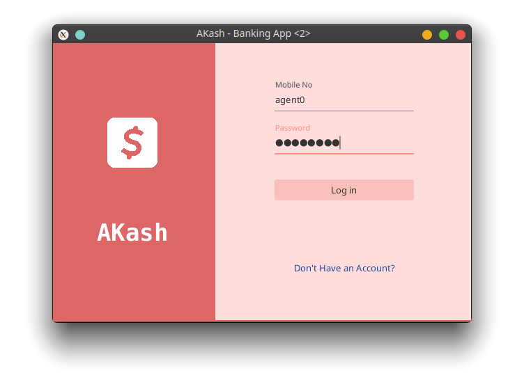
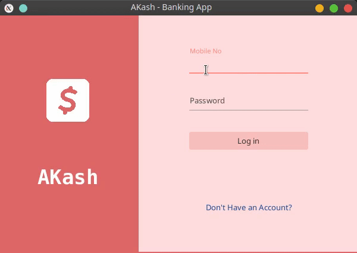
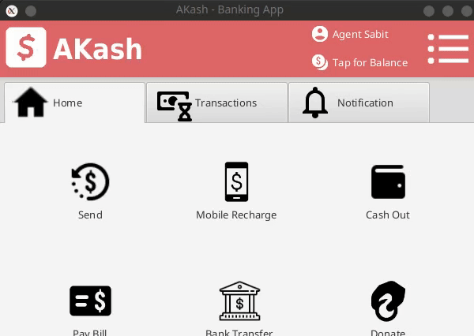
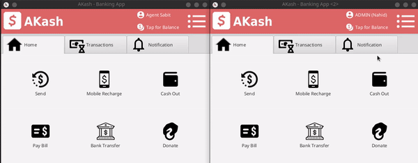
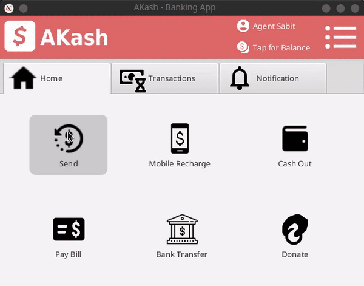
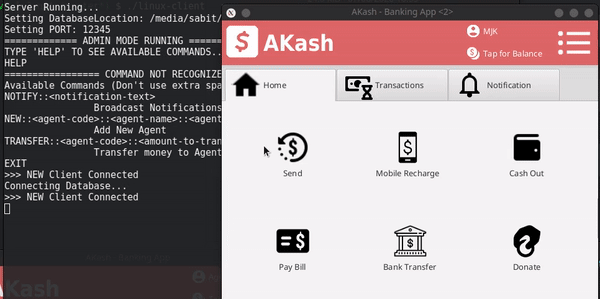
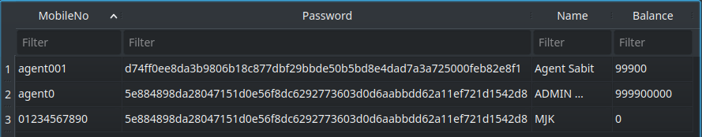

# Akash – Banking App
 
  
AKash is a simple Banking Application using Java & JavaFX
  
## User Interface:  
  

Video Link: [Youtube](https://www.youtube.com/watch?v=U4to-xGq1NY)  

## Dependencies
- JDK 11+
- JAVAFX for Java 9+
  
## How to run?
- In the __release__ folder, you'll find Jar Files
- Edit the script files (.bat for windows/.sh for linux) according to your settings
- Execute the script files (First Server, then Client)
  
## How to use
  
- You can use command line of Server to execute ADMIN works  
  
  
- Or you can log in as Admin from GUI App  
  
Mobile   : agent0
Password : password  
(Use App to change password)
  
- Use GUI App to __Signup__ & __Log in__ (Agent/User)  
  
See Transaction (With Filter)  
  
- Know Balance and Change Password (Applicable for all)  

  
- Cash Out or Send Money to Agent  
  
  
- Send Money to User or Cash in from Agent  
  
  
- Mobile Recharge, Bank Transfer, Bill Pay and many More...
  
  
- Uses SHA256 Hashing to store password  

Add a __[ ☆ Star | +1 ]__ which may motivate me  
For any Query, [mail](mailto:sabit.jehadul.karim@gmail.com) me or [knock](https://www.facebook.com/MdJehadulKarim) me on facebook.